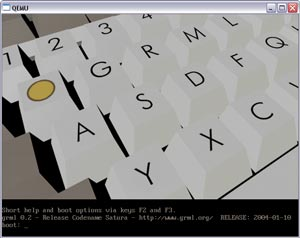

+++
title = 'QEMU'
icon = 'clanbomber'
+++

[QEMU](https://www.qemu.org/) is an emulator for various CPUs.
It works on Linux, Windows, FreeBSD and Mac OS X.
It's possible to run Grml with QEMU.
Note that it is slower than running it native due to the emulation mode.

## Using QEMU with acceleration

On modern Linux distributions, including Grml, the kernel comes with an acceleration module, called `KVM`.
To use this, load the `kvm.ko` kernel module, and give yourself rights:

<pre class="rahmen">
apt update && apt install qemu-system        # install qemu
modprobe kvm                                 # load the kernel module
</pre>

If you are not logged in locally (just SSH does not count), your user also must be in the `kvm` group:
<pre class="rahmen">
adduser $USER kvm                            # add your user to kvm group
# now login again or try: newgrp kvm
</pre>

To see if kvm is enabled and working correctly, use the QEMU monitor command (press ctrl-alt-2): 'info kvm'

## Usage examples

In all examples below you can add `-nographic -vga none` to get the first serial console on your terminal.
This might work better on arm64, where the Linux kernel by default expects a serial console, and less good on amd64.

The example use `-m 2048` for 2GB (2048MB) of virtual memory (RAM).
They do not pass any CPU core counts, so you get one virtualized CPU core.
Use `-smp 2` to enable 2 CPU cores, for example.

### Boot Grml ISO on arm64 (aarch64)

This assumes the firmware shall be UEFI EDK2 ("TianoCore").
This is the best supported QEMU target on arm64.

This also assumes that your host is actually arm64 and has KVM support.

<pre class="rahmen">
apt update && apt install qemu-system qemu-system-gui qemu-efi-aarch64
cp /usr/share/AAVMF/AAVMF_VARS.fd efi_vars.fd
qemu-system-aarch64 \
    -machine type=virt,gic-version=max,accel=kvm:tcg \
    -cpu max \
    -m 2048 \
    -drive if=pflash,format=raw,unit=0,file.filename=/usr/share/AAVMF/AAVMF_CODE.no-secboot.fd,file.locking=off,readonly=on \
    -drive if=pflash,unit=1,file=efi_vars.fd \
    -monitor unix:qemu-monitor-socket,server,nowait \
    -cdrom ~/grml-full--arm64.iso
</pre>

To access the QEMU monitor, you can use socat on a separate terminal:

<pre class="rahmen">
apt update && apt install socat
socat -,echo=0,icanon=0 unix-connect:qemu-monitor-socket
</pre>

From there you can run commands like `info kvm` or `quit`.

### Boot Grml ISO on amd64 (64-bit PC), UEFI

This assumes the firmware shall be UEFI EDK2 ("TianoCore").
This also assumes that your host is amd64 and has KVM support.

We picked machine `q35` (over `i440fx`) as it is a more modern (mostly legacy-free) x86 machine.

QEMU monitor will be available on stdout.

<pre class="rahmen">
apt update && apt install qemu-system qemu-system-gui ovmf
cp /usr/share/OVMF/OVMF_VARS_4M.fd efi_vars.fd
qemu-system-x86_64 \
    -machine type=q35,accel=kvm:tcg \
    -cpu max \
    -m 2048 \
    -drive if=pflash,format=raw,unit=0,file.filename=/usr/share/OVMF/OVMF_CODE_4M.fd,file.locking=off,readonly=on \
    -drive if=pflash,unit=1,file="efi_vars.fd \
    -monitor stdio \
    -cdrom ~/grml-full--amd64.iso
</pre>

### Boot Grml ISO on amd64 (64-bit PC), Legacy BIOS

This will boot using legacy BIOS firmware, usually SeaBIOS.

<pre class="rahmen">
apt update && apt install qemu-system qemu-system-gui seabios
qemu-system-x86_64 \
    -machine type=q35,accel=kvm:tcg \
    -cpu max \
    -m 2048 \
    -monitor stdio \
    -cdrom ~/grml-full--amd64.iso
</pre>

## Running Grml under QEMU on Windows

First of all download <a href="https://www.qemu.org/download/#windows">QEMU for Windows</a>.
<a href="/download/">Download a Grml ISO</a> and put the QEMU files in the same directory as the Grml ISO.

Now create a startup file, call it for example <a href="grml-qemu.bat">grml-qemu.bat</a>:

<pre class="rahmen">
REM Start qemu on windows.
@ECHO OFF
START qemu.exe -L . -m 2048 -hdc harddisk -cdrom grml-full--amd64.iso
CLS
EXIT
</pre>

Adjust the values if necessary and now run the grml-qemu.bat-file. Have fun :-)

