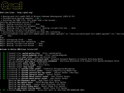

+++
title = 'Screenshots'
icon = 'mycomputer'
+++

<h2>Bootsplash / BIOS</h2>

 

This screenshot shows the bootsplash in BIOS mode.

<h2>Bootsplash / EFI</h2>

 

This screenshot shows the bootsplash in EFI mode.

<h2>Booting</h2>

 

This screenshot shows the bootup sequence right after the bootsplash.

<h2>Console</h2>

 

This screenshot shows links2 on a framebuffer device.
That's what you'll see when running 'grml-info' on the console.

<h2>zsh</h2>

 

This (nostalgic) screenshot shows GNU screen running on console using framebuffer
device with zsh and the completion mechanism of zsh running cdrecord.

<h2>X Window System - fluxbox</h2>

 

This screenshot shows Grml 2024.12 running the X Window system with the <a
href="https://fluxbox.sourceforge.net/">fluxbox</a> window manager.

