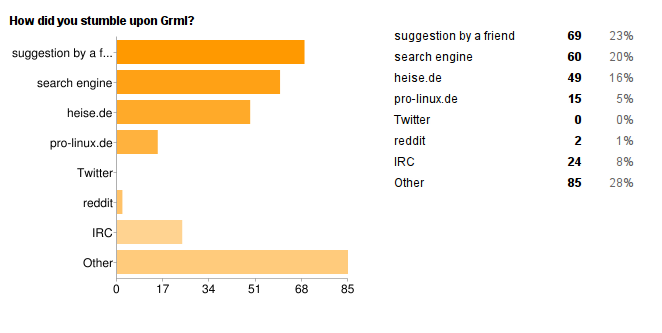
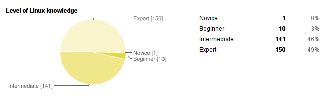
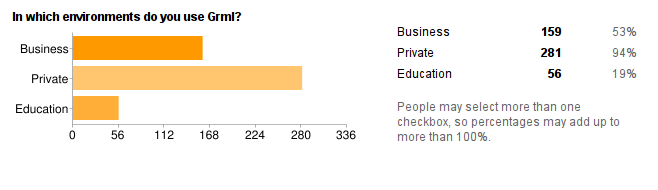
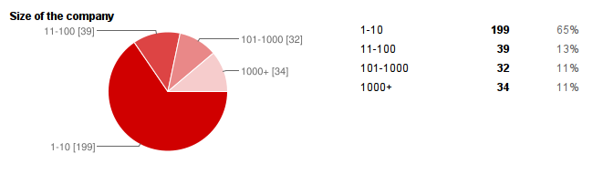
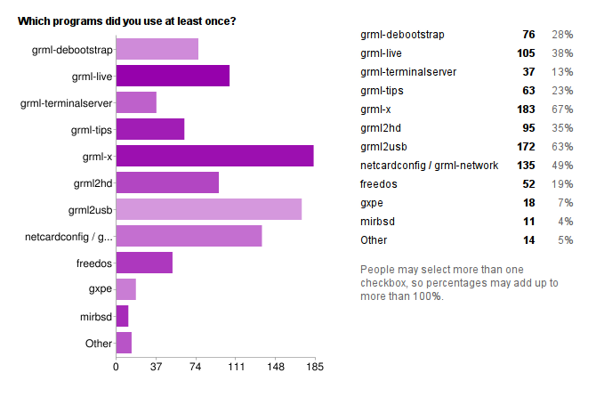
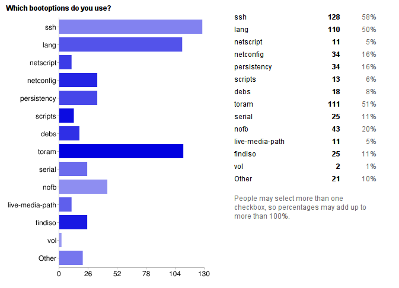
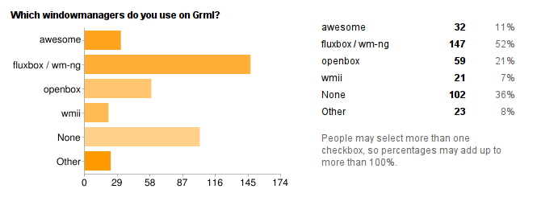
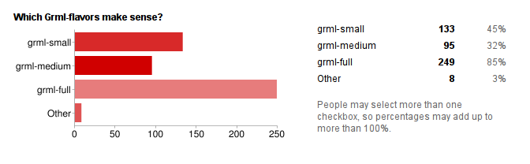
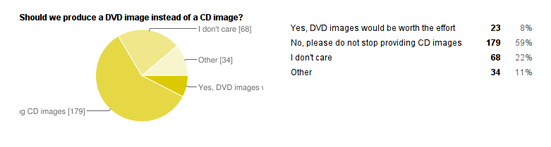

+++
title = 'Grml User Survey 2011'
+++
<h2>Preface</h2>

In the beginning of 2011 we started a Grml user survey. From our
point of view it was an overwhelming success. As promised we will
share the results and discuss the feedback we got in detail.

<abbr title="Too long; didn't read">tl;dr</abbr>? Skip to the <a href="#conclusion">conclusion</a>.
Interested in <a href="#toc">all the answers</a>?

<h3>The Good</h3>

First of all some numbers regarding our user survey. 28
questions, answered by more than 300 users in a timeframe of less
than one month. This means more than 8000 entries. On the day of the
announcement more than 70 people answered our survey. For our last
<a href="https://github.com/grml/grml/wiki/survey07">user survey back in 2007</a> 103 people answered in one month. Long story short: it
was an overwhelming success.

Due to the many open questions we got some interesting, fun and
exciting answers. We also got some nice use cases for Grml.

The overall quality of the provided answers, especially in the
custom texts were astonishing and we all enjoyed them.

<h3>The Bad</h3>

Obviously some questions could have been asked in a better way,
for example the DVD question. Instead of asking &quot;should we
produce DVD Images&quot; we could have asked if its worthwhile to
keep the 700MB limit for the CDs. Nevertheless we now know that a
DVD-image is not really important and worthwhile as most of you want
to get CD-sized images these days.

As we used Google Forms we did not get the IP address of the
participant. So we weren't able to gather geographic information
about the participants. We fixed this after we noticed the problem
by adding another question asking participants about their
location.

We did not ask about contact information but it would have been
worthwhile in some cases to get back to our users and provide
answers or hints. We did not change the survey as we were unsure if
its appropriate to ask for contact information in a survey.

Most answers did not result in immediate actions but we already
discussed the inclusion of provided packages and had a look at
provided URLs.

<h3>The Ugly</h3>

We used Google Forms and had many &quot;Other options&quot;
available. Unfortunately Google automatically translates predefined
labels. This means for e.g. persons from german speaking countries
the &quot;Other&quot; label was called &quot;Andere&quot; or the
submit button &quot;Absenden&quot;. It would be great to disable
that feature or provide proper multi language form support in Google
Docs. Also the evaluation of custom answers turned out to be a lot
of work.

<h2>Conclusion</h2>

Our strong focus on system administration tasks has been affirmed
by our users in 2007 and today. We will continue to aim to be the
best speciality Debian-based distribution for these use cases.
Desktop users will continue to be supported on the same level as
always. 

While our user base is strong in Europe, we must expand further into
US and Asia. A first step, namely new mirrors closer to these
regions, has already been made.

A lot of awesome software has been suggested and some of it
already made it to the daily Grml builds. We will continue to work
on adding new software, but the important &quot;One CD&quot; (700MB)
limit is obviously a hard barrier. 

We still want your feedback on all topics, but especially from
users of non-Debian-based distros. What do you like, what's missing,
what's bad for you? <a href="http://feedback.grml.org/">Send and
  share your feedback</a> or <a
  href="/contact/">drop us a message</a>!

<strong>Thanks to everyone taking part in our survey!</strong>

<h3>Table of Content - the Answers</h3>

<ul>
  <li>About you
    <ul>
      <li><a href="#since_when">Since when have you been using Grml?</a></li>
      <li><a href="#stumble">How did you stumble upon Grml?</a></li>
      <li><a href="#located">Where are you located?</a></li>
      <li><a href="#knowledge">Level of Linux knowledge</a></li>
      <li><a href="#operating_systems">Which operating systems do you use?</a></li>
      <li><a href="#distributions">If you are using Linux, which distributions do you use?</a></li>
      <li><a href="#project_name">Did you start your own Open Source project?</a></li>
      <li><a href="#project_areas">Are you involved in any FLOSS projects? If so in which areas?</a></li>
      </ul>
  </li>

  <li>Company &amp; Use case
    <ul>
      <li><a href="#environments">In which environments do you use Grml?</a></li>
      <li><a href="#company_name">If you are using Grml in a company, what is the name of the company?</a></li>
      <li><a href="#company_size">Size of the company</a></li>
      <li><a href="#company_industry">Industry of the company</a></li>
      <li><a href="#company_quote">Is there anything you and/or your company would like to say about Grml?</a></li>
    </ul>
  </li>

  <li>Questions about Grml
    <ul>
      <li><a href="#bootmedia">Which boot media are you using for Grml?</a></li>
      <li><a href="#using_grml_for">Ever used Grml for...</a></li>
      <li><a href="#creative_solution">What's your most creative solution with Grml?</a></li>
      <li><a href="#why_using_grml">Why are you using Grml?</a></li>
    </ul>
  </li>

  <li>Tools &amp; Programs
    <ul>
      <li><a href="#using_programs">Which programs did you use at least once?</a></li>
      <li><a href="#bootoptions">Which bootoptions do you use?</a></li>
      <li><a href="#windowmanagers">Which windowmanagers do you use on Grml?</a></li>
      <li><a href="#tools">Which tools would you like to see on Grml?</a></li>
    </ul>
  </li>

  <li>Future of Grml
    <ul>
      <li><a href="#flavours">Which Grml-flavors make sense?</a></li>
      <li><a href="#dvd">Should we produce a DVD image instead of a CD image?</a></li>
      <li><a href="#ship_windowmanagers">Should we ship multiple window managers?</a></li>
      <li><a href="#debian_stable">Do you use Grml packages on Debian-Stable?</a></li>
      <li><a href="#what_should_be_changed">What else should be changed in Grml?</a></li>
    </ul>
  </li>

  <li>Anything else?
    <ul>
      <li><a href="#wishlist">Wishlist for improvements on Grml</a></li>
      <li><a href="#famous_last_words">Did we forget anything? Any famous last words?</a></li>
    </ul>
  </li>

</ul>

<h2>About you</h2>

<h3>Since when have you been using Grml?</h3>

We seem to have a healthy mixture out of longstanding as well as
newer users which we consider a good sign to provide high quality
together with enough innovation.

<h3>How did you stumble upon Grml?</h3>

Most users come from suggestions by friends or on IRC as well as
independent websites. Just about a quarter stumbled upon Grml
through official media press. We consider this result as a healthy
combination and a proof of the rule how important word-of-mouth
recommendations are. Our favourite custom answer: The internet.

<h3>Where are you located?</h3>

The first 65 survey results lacked this question and 5% didn't
answer this question. As the chart shows we cover all continents but
Europe is the place with the largest user base. At the last Grml
developer meeting we decided to put effort into providing mirrors
outside Europe. Thanks to people providing mirrors rit.edu (New
York/US) and ftp.tw.debian.org (Taiwan) our mirror coverage improved
a bit already, but our efforts toward improving Grml's coverage
outside Europe won't stop.

<h3>Level of Linux knowledge</h3>

Most people classify themselves as experts or intermediate. This
fits well in our focus. We think we are on track with our user
base.

<h3>Which operating systems do you use?</h3>

99% of Grml's users use Linux and interestingly BSD got a better
result than Mac OS. Amongst the answers in &quot;others&quot; have
been Solaris, Haiku, Netware, HPUX, AIX, MS-DOS/FreeDOS, irix, Palm
OS5 and Symbian S40, whereas Solaris was the leading answer in
&quot;others&quot; with an overall count of 23.

<h3>If you are using Linux, which distributions do you use?</h3>

With a leading 86% our users are Debian users. Nearly half of
them also use Ubuntu (or any Ubuntu based derivative) whereas other
Linux distributions have a coverage of less than 20% each. The
answers &quot;others&quot; included 21x Arch Linux, 10x Grml (hehe!
:)), 5x (Free/Open/....)WRT, 3x LFS, 3x Knoppix, 3x Maemo, 2x puppy,
2x MEPIS, 2x Mint, 1x DSL, 1x Slacks, 1x Aptosid, 1x Archbang, 1x
Quirky, 1x Mandriva, 1x Scientific Linux, 1x Sabayon, 1x OpenBSD
(huh? :)), 1x SLiTaz, 1x CrunchBang, 1x AntiX. As a result we can
say that most of our users seem to be used to Debian(-based)
distributions.

<h3>Did you start your own Open Source project?</h3>

We got 32 answers, which namely included the following Open
source projects: bley, wApua, unburden_home_dir, xpt, Hag
(hag-linux.eu.org, Grml derivative or rather a remix BTW, now kinda
dead, but I still have some plans), baculafs, undbx, HOG-Man
(scientific software), more than 15 ones (the currently most popular
being jpdftweak), variety of very small projects, IdyllaOS,
timecalc, rffc, bwm-ng, immv, FAI, i3, goldbach, FVWM-Crystal, FDTD,
Nagiosms, MirBSD, My personal gooogle, SNPpy, bixfile, ngircd,
MikeBrother, HME, gocr, octopus-window-manager, wedabecha, libgpmi /
v7us / libmawk / scconfig / libporty and a lot more.

<h3>Are you involved in any FLOSS projects? If so in which
  areas?</h3>

Most of our user are directly involved in development with code
62%, documentation 47% and support 44%. Quite some are also involved
in packaging (36%) which is no surprise given that Grml is based on
Debian and got featured several times on planet.debian.org.

<h2>Company &amp; Use case</h2>

<h3>In which environments do you use Grml?</h3>

Nearly all Grml users do use Grml for personal use (94%), whereas
53% use Grml in a business environment. 19% of Grml users are using
it in an educational environment. This means that most people use
Grml for work as well as in their personal environment. Maybe we
should provide some examples how to use Grml in different
environments (Rescue system for virtualised systems, deployment
etc.)

<h3>If you are using Grml in a company, what is the name of the
  company?</h3>

We got several names of companies using Grml. Amongst them are
established universities as well as well known companies. Thanks for
your feedback, we plan to provide the list through a separate
webpage in the near future.

<h3>Size of the company</h3>

<h3>Industry of the company</h3>

No big surprises - most companies are IT related. However there
are some non-IT related industries like ecology, healthcare, online
gambling and tourism as well. Now we are sure that Grml is used in
all different kinds of industries and well accepted.

<h3>Is there anything you and/or your
    company would like to say about Grml?</h3>

First of all, thanks for all the nice and interesting answers.
This was one of the most fun parts to read in the whole survey.

Some example quotes:

<ul>

  <li>The simplicity of grml often astonishes people around me when
  I am doing a 1:1 backup using dd or recovering their presumably
  lost data with testdisk</li>

  <li>Pure Awesome in tiny ~700 MB :D Seriously, lots of big thanks
  for maintaing such a great project! Also; kudos for the great
  naming convention!</li>

  <li>A real Swiss Army Knife for Linux sysadmins.</li>

  <li>Best utility Live distro ever.</li>

  <li>It just fits. Everything is in place and ready to use. From
  drivers to firmwares (like wifi, fibre channel), programs:
  ddrhelp, irssi and many others not available elsewhere</li>

  <li>Reliable, stable and powerful Linux live CD/USB distro. Great for
  auto write blocking hardware for forensic acquisitions</li>

  <li>In the past I used knoppix as rescue, since I know grml, I do not
  need knoppix any more</li>

  <li>Great work. Thank you so much. Btw, I have just &quot;chsh
  --shell zsh&quot; because of your great zsh configuration</li>

</ul>

<h2>Questions about Grml</h2>

<h3>Which boot media are you using for Grml?</h3>

CDs are still the most important boot media at 79%, followed by
USB with 76%. This means we are on the right track with providing
easy to use solutions with grml2usb and dd for our users.
Network/PXE setups with 28% and hard-disk installations (18%) are
not as common as CDs and USB sticks but still often used. Especially
considering the fact that network/PXE environments typically serve
larger environments we consider 28% to be an excellent value.

Answers filed under &quot;Other&quot; included:

<ul>

  <li>VM</li>

  <li>ISO on harddisk if the main installation is broken.
  <strong>Comment:</strong> now directly supported with grml-rescueboot</li>

  <li>DVD <strong>Comment:</strong> someone using grml2iso</li>

  <li>cd image in a VM</li>

  <li>multiboot usb (grml2usb/local.cfg for the rescue)</li>

  <li>image via toram= (good choice to use debian-live)</li>

  <li>virtual cd drive. <strong>Comment:</strong> seems to be also
  used in a virtual environment (IBM RSA, HP iLO,...)</li>

  <li>iso on hd from grub2. <strong>Comment:</strong> check out grml-rescueboot</li>

  <li>Remote boot via iso.</li>

  <li>isofrom (hard disk)</li>

  <li>iso file</li>

  <li>.ISO within Virtual Machine</li>

  <li>Compact Flash</li>

  <li>Boot from iso</li>

</ul>

We should promote the <a
  href="http://michael-prokop.at/blog/2011/01/07/booting-iso-images-from-within-grub2/">grml-rescueboot
  feature</a> more prominently as it seems that there is a market
for it.

<h3>Ever used Grml for...</h3>

While we had a look at the answers we immediately noticed that
most people (&gt;90%) used Grml for more than one task. This shows
that Grml is quite flexible and can be used in several different
areas. While the high percentages for Recovery (92%), Hardware
diagnostic (77%), Backup (62%) and Network analysis (52%) are no big
surprises, the percentages for Forensic (40%), Linux Desktop (29%)
and Programming (16%) truly are. This result means that we should
keep the Linux Desktop and Programming tasks in mind though the main
focus is still on the classic use cases.

<h3>What's your most creative solution with Grml?</h3>

Ok guys, again. Your answers were really cool and nice, and we
are sorry to only give you some quotes but it would take up several
pages:

<ul>

  <li>My desktop system is basically a USB disk that boots my
  (remastered) grml (one partition contains the grml &amp; grml64
  ISOs) and has all user data on another partition (grml-crypt is
  another neat tool to secure that data). That way, I have my
  desktop with me everywhere.</li>

  <li>We set up a grml PXE server in a VM on VSphere 4, because if a
  client doesn't boot, grml is the first thing we need.</li>

  <li>PXE-Server which automatically installed Debian via FAI to
  multiple machines.</li>

  <li>Grml makes it easy to configure and manage a network of 20+
  servers: 20+ vmware machines all boot from a single copy of
  grml.</li>

  <li>grml64micro, a stripped down remastered version of grml to fit
  into some few free MB in /boot </li>

  <li>When I started using it, it was primarily for installing
  Gentoo.</li>

  <li>We wrote some auto-install scripts that can non-interactively
  install certain flavours of Linux on the computer we booted grml
  on.</li>

  <li>I like my phone-home image which boots up with X and opens a
  tunnel to me. I had nothing to hack since you guys have so many
  possibilities to modify behaviour. THANKS!</li>

  <li>automatic boot into an remote application server for idle/unused
  workstation PC</li>

  <li>plug in grml stick, plug in network card, boot it, it will ask
  you what system you want to install using dialog(1) then it
  automatically partitions the disk, pulls all the packages and
  custom software, makes it bootable, configures IP addresses.
  Reboot, enjoy.</li>

  <li>public surf station (kiosk)</li>

</ul>

Most solutions are related to deployment and rescue. But some are
also using it for other purpose like a modified desktop systems.

<h3>Why are you using Grml?</h3>

Also just a short overview but it seems that the most important
reasons for using Grml are:

<ul>

  <li>Based on Debian</li>

  <li>Command-line interface</li>

  <li>Ships all necessary command-line tools</li>

  <li>Zsh</li>

</ul>

This means we are on the right track. An excerpt of the
answers:

<ul>

  <li>Great terminal tools, great choice of X environments (I use
  dwm and evilwm), very well configured out of the box to discover
  and give me information on any box or network I boot it from.</li>

  <li>because it`s based on debian, it early had amd64 support, zsh
  rocks, in rescue mission its important to have a distri, which
  supports LVM2 and raid systems oftb, the team reacts very quick on
  suggestions and answers</li>

  <li>moved from Knoppix to grml (less X and Office -&gt; more SHELL
  and Tools) - love debian - love the many, many grml-.... scripts
  that make it so handy to use - love the names (Funkenzutzler 4 the
  win !!!elf)</li>

  <li>It's debian-like; I couldn't get debian-live to work for me; It's
  easy to customize; It contains *all* the packages I needed</li>

  <li>Meets my basic requirements for a rescue distribution: Debian
  based, bootable from USB with data persistence, customizable...
  and it has Emacs!</li>

  <li>I love GRML. I love what you guys do. I love GRML. I really,
  really love GRML. This distro has deeply affected my interest in
  Linux by providing me with out-of-the-box customized professional
  linux awsomeness. I will never be as good as you guys at anything
  that you do, I will never be as smart as you guys and I have a
  fraction of the talent. I could never write a single one of these
  scripts or customizations.I will never be a professional
  programmer and I will never be as good at anything as you are at
  this. But you have allowed me to see what you do and get right in
  there and do it to, you have allowed me to this extremely advanced
  stuff that I would never have the chance to access otherwise, let
  alone even be aware of.</li>

  <li>1) It boots without X11. 2) Every tool I ever expected to be there,
  was there.</li>

  <li>release names :)</li>

  <li>GRML converted me to zsh. Now I use GRML because of zsh.</li>

  <li>We tried other live system, of course Knoppix and Kanotix, but Grml
  just rocks the machines better!</li>

  <li>Several reasons, in no particular order: * Debian based. *
  Updated regularly (recent kernel, recent userspace readily
  available in daily snapshots). * No GUI bloat I wouldn't need
  anyway. * Excellent zsh config (I now install grml-scripts by
  default on most of my systems). * Approachable developers. *
  grml2usb. * grml2ram. * 64bit flavour available.</li>

  <li>At a first view it seems to have a lot of possibilities in one
  place - ready to use,  The best I ever have seen, I may say:
  Wonderful.</li>

  <li>This was the more interesting part to me: &quot;Grml includes a
  collection of GNU/Linux software especially for system
  administrators and users of texttools&quot;...</li>

  <li>Great hardware support and includes all the tools a sysadmin
  might need.</li>

</ul>

<h2>Tools &amp; Programs</h2>

<h3>Which programs did you use at least once?</h3>

Unsurprisingly grml-x is the most used program. Second most used
Grml script is grml2usb which is a little bit surprising as it means
that for installing Grml to an usb stick it wins over the dd(1)
method for many people. grml-network respectively netcardconfig is
also expected as you sometimes need to configure your network.
grml-live is used more often than grml2hd (which BTW is unsupported)
and grml-debootstrap. This means that (at least for our
participants) remastering is more common than installing Grml/Debian
from within Grml..This clearly shows that Grml can be considered as
a framework for generating and maintaining flexible Live
Distributions.

Surprisingly MirBSD is used less often than FreeDOS and gPXE.

For &quot;other&quot; mostly non Grml-specific tools were
mentioned, as well as some not so well known Grml tools like
grml-crypt (wrapper for cryptsetup) and grml-chroot (wrapper for
chroot, binding /sys, /proc and /dev to the chroot) as well as
grml-quickstart. We plan to improve our documentation to cover those
not so well known tools.

<h3>Which bootoptions do you use?</h3>

ssh (start an ssh server while booting), toram (copy the whole cd
into ram) and lang (set the language) are the most commonly used
bootoptions, covering the common use cases. nofb at 20% was
unexpected. Probably there are quite a few machines where our
default console configuration (framebuffer) does not work.

As one user requested a way to automatically start user-supplied
scripts, we want to mention that there's already the
&quot;script&quot; bootoption (see <a
  href="http://git.grml.org/?p=grml-live.git;a=blob_plain;f=templates/GRML/grml-cheatcodes.txt;hb=HEAD">grml-cheatcodes.txt</a>).

Surprisingly &quot;forensic&quot; is also quite often mentioned
as bootoption. If you're interested in a special product on IT
forensics you might want to check out <a
  href="http://grml-forensic.org/">Grml-Forensic</a>.

<h3>Which windowmanagers do you use on Grml?</h3>

Most common answers were fluxbox / wm-ng (Grml default) and None,
right in line with our design target: a proper console. Others
mention several small window manager like ratpoison, dwm, i3
etc.

Because many window managers were mentioned we may reassess the
(re)inclusion of some small window managers.

<h3>Which tools would you like to see on Grml?</h3>

Several tools mentioned here are already included in Grml like
for example KVM, others will not be included due to licensing
issues. For a complete list of packages shipped by Grml have a look
at <a
  href="/files/release-2010.12/dpkg_get_selections">/files/release-2010.12/dpkg_get_selections
  </a>

We are currently in the process of reviewing all suggested
packages and may come up with details at a later date.

<h2>Future of Grml</h2>

<h3>Which Grml-flavors make sense?</h3>

Grml-full seems to make sense as well as grml-small. Grml-medium
is not quite often used. One interesting suggestion is to combine
grml-small and grml-full on one CD. We don't have any plans to ship
this, but you can easily do this yourself with grml2iso. Another
suggestion was to create a special version for virtualised
environments named grml-virt.

While grml-medium is not as well accepted as grml-small and
grml-full in our community, we will continue to ship grml-medium as
it's the perfect and recommended starting point for customized Grml
distributions.

<h3>Should we produce a DVD image instead of a CD image?</h3>

As already stated this question was not that helpful. Nothing to
comment besides the graphics and what has been mentioned
already.

<h3>Should we ship multiple window managers?</h3>

Although the X server isn't used that often on Grml, its users
commonly want to use their favourite window manager. As already
stated we will reassess the (re)inclusion of some small window
managers because of your answers.

<h3>Do you use Grml packages on Debian-Stable?</h3>

Installation of Grml packages on Debian is a rare occurrence,
except for grml2usb on Debian stable. Consensus is to not put too
much effort into it.

<h3>What else should be changed in Grml?</h3>

Besides some UX things like better artwork/no links (the browser)
after startup in X.org etc. most feedback was quite positive. We got
some detailed suggestions like better wireless configuration,
automatic selection of the kernel in multiarch environments, and
others. We are looking into your requests.

<h2>Anything else?</h2>

<h3>Wishlist for improvements on Grml</h3>

We got some really nice ideas like inclusion of support for other
boot images in our GRUB environment or multiarch CDs. Better
documentation as well as some How-tos was also mentioned several
times. Oh and more professionalism for our wallpapers. It seems that
at least in one work environment our wallpaper caused some
blush.

<h3>Did we forget anything? Any famous last words?</h3>

This is again mainly positive things, so just some examples:

<ul>

  <li>I hate to disagree with the devs oft stated opinion, but grml
  is still the best desktop installer to create a usable desktop
  environment, because everything just works out of the box, and has
  no distro specific absurdities, like the famous debian forks.</li>

  <li>Great distro, truley a masterpiece of work.</li>

  <li>grml is 2 percent Jazz, 98 percent funky stuff ... </li>

  <li>It is great and it is debian</li>

  <li>Why don't you get rid of this strange ZSH and switch to the
  industry standard bash?!?! Haha, j/k :-)</li>

  <li>Simple: Grml rocks! Thanks for the great work. </li>

  <li>The answer must be, of course, 42.</li>

  <li>United as one! Divided by zero!</li>

  <li>I like the cool distribution names!</li>

  <li>Thanks guys, I appreciate the work you've put into this
  distro.</li>

</ul>

<a href="#top">Go to the top...</a>

