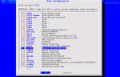

+++
title = 'grml-terminalserver'
icon = 'clanbomber'
+++

<h2>Introduction</h2>

Using grml-terminalserver you can boot grml via network. If your
computer is able to boot via <a
    href="http://en.wikipedia.org/wiki/PXE">PXE</a> (Preboot Execution
Environment) all you have to do is start grml-terminalserver on the host
which should serve as booting server and boot Grml via network/PXE on
the client(s) then. If your computer can't handle PXE you can still try
to boot Grml via network, because grml-terminalserver lets you create a
floppydisk including a bootimage with your networkcard-driver to boot
via network. If that's still not an option for you check out the <a
    href="https://ipxe.org">iPXE</a> project.

How to start grml-terminalserver? Just invoke grml-terminalserver as
user root and follow the instructions. Take a look at the manpages
grml-terminalserver and grml-terminalserver-config.

<h2>Boot Grml without grml-terminalserver?</h2>

Sure - of course you can boot Grml via PXE without having to use
grml-terminalserver (for example if you already have a working NFS,
tftp,... infrastructure). Take a look at <a
    href="https://github.com/grml/grml/wiki/terminalserver#booting_grml_without_grml-terminalserver">the
    instructions in the grml-wiki</a>.

<h2>Screenshots</h2>

Select ip address range for clients

Are there any computers without PXE?

Select networkcard drivers for non-PXE capable computers

Write grub image to floppy disk?

<h2>Known Issues / Further information</h2>

See <a
href="https://github.com/grml/grml/wiki/terminalserver">grml-wiki</a>.

